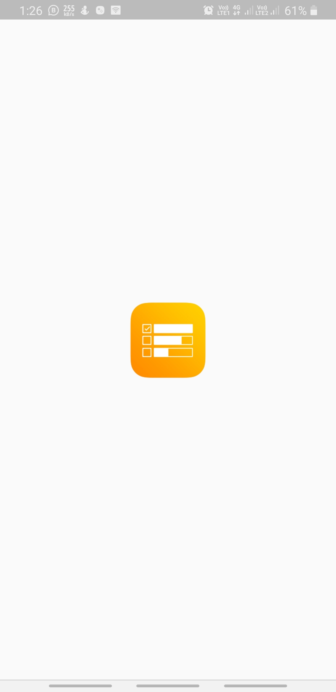
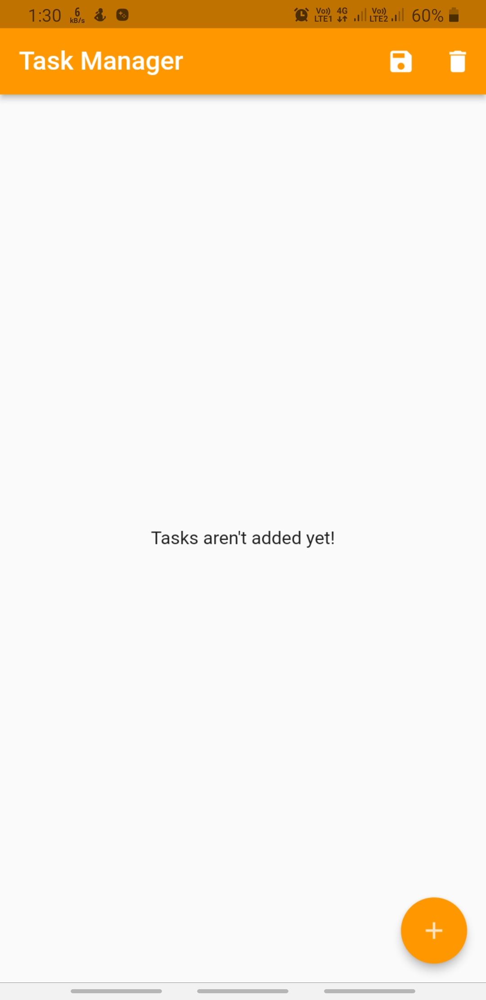
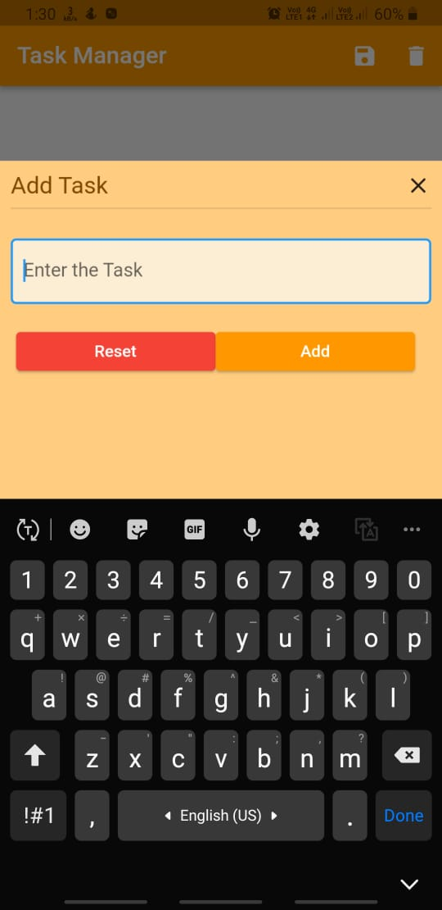
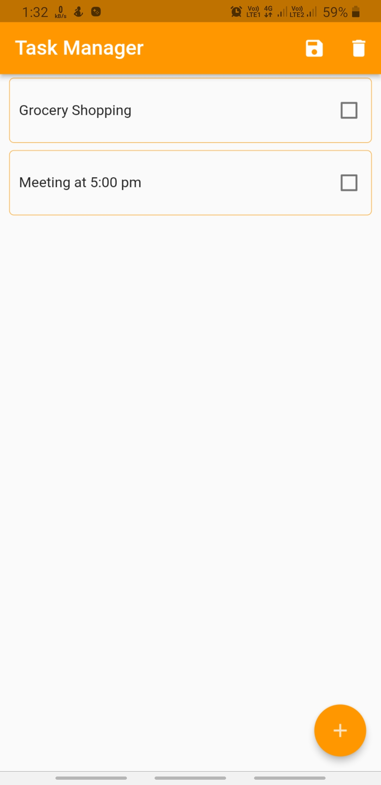

# Welcome

This repository houses the code of a Task Manager App. Feel free to explore the project.

<b> Sample Images </b>

&nbsp;&nbsp;&nbsp;&nbsp;&nbsp;&nbsp;&nbsp;&nbsp;&nbsp;&nbsp;&nbsp;&nbsp;

<b>Email: vijayshankarmishra003@gmail.com</b>

<b>LinkedIn: https://www.linkedin.com/in/vijay-shankar-mishra-52b732220/</b>

Thank you for visiting my repository! I hope you find my work interesting and valuable. Your feedback and suggestions are always welcome.
Happy coding!

<b>Please follow below steps to run the app.</b>

## Getting Started

This project is a starting point for a Flutter application.

A few resources to get you started if this is your first Flutter project:

- [Lab: Write your first Flutter app](https://docs.flutter.dev/get-started/codelab)
- [Cookbook: Useful Flutter samples](https://docs.flutter.dev/cookbook)

# Installation
To get started with Your Task Manager App, follow these steps:

<b>Clone this repository: git clone https://github.com/vijaymishra003/Task-Manager-App.git</b>

<b>Navigate to the project directory using:</b> "cd Task-Manager-App" command

<b>Install dependencies using:</b> "flutter pub get" command

<b>Run the app using:</b> "flutter run" command

For help getting started with Flutter development, view the
[online documentation](https://docs.flutter.dev/), which offers tutorials,
samples, guidance on mobile development, and a full API reference.
